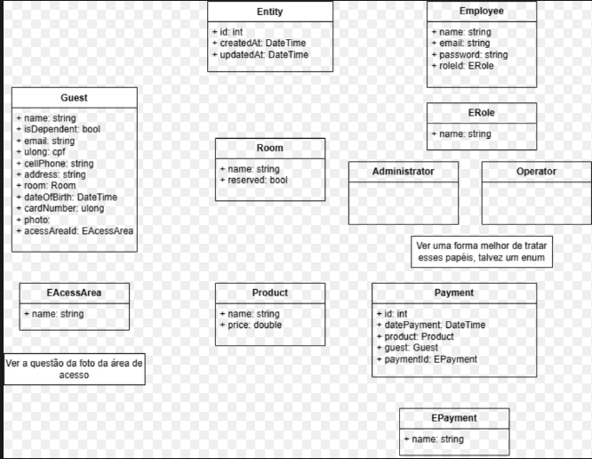

# HOTEL CARD: Sistema de Gestão de Hóspedes e Acessos

## Descrição

O HOTEL CARD é um sistema desenvolvido para gerenciar de forma eficiente os dados de hóspedes, controlar os acessos às áreas do hotel e monitorar o consumo de serviços. O sistema utiliza cartões de acesso para registrar as entradas e saídas dos hóspedes além de registrar consumos, proporcionando maior segurança e controle.

**Objetivo:**

* Centralizar as informações dos hóspedes em um único sistema.
* Controlar os acessos às áreas restritas do hotel.
* Monitorar o consumo de serviços pelos hóspedes.
* Facilitar a geração de relatórios para a gestão do hotel.

**Funcionalidades:**

* **Cadastro de Hóspedes:** Cadastro completo de hóspedes, incluindo dados pessoais, reservas e informações de contato.
* **Gerenciamento de Cartões:** Emissão e gerenciamento de cartões de acesso para hóspedes e funcionários.
* **Controle de Acessos:** Registro automático das entradas e saídas dos hóspedes por meio dos cartões.
* **Monitoramento de Consumos:** Controle do consumo de serviços como room service, minibar, etc.
* **Geração de Relatórios:** Criação de relatórios personalizados para análise dos dados do sistema.

**Tecnologias Utilizadas:**

* **Front-end:** Js, html5, css, react
* **Back-end:** c#
* **Banco de dados:** Mysql
* **Outras tecnologias:** github, figma

## Figma

(https://www.figma.com/design/omu7PuAuTqiEP7uDis9MZK/hotel-card?node-id=0-1&t=nsLzcXCoRz2UegUY-1)

## Modelo Entidade-Relacionamento (MER)

